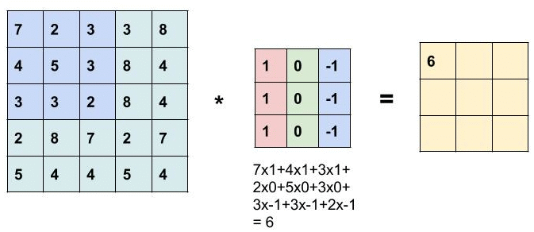
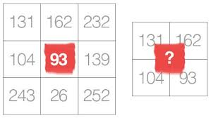
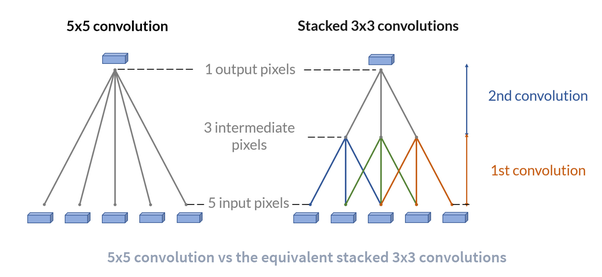
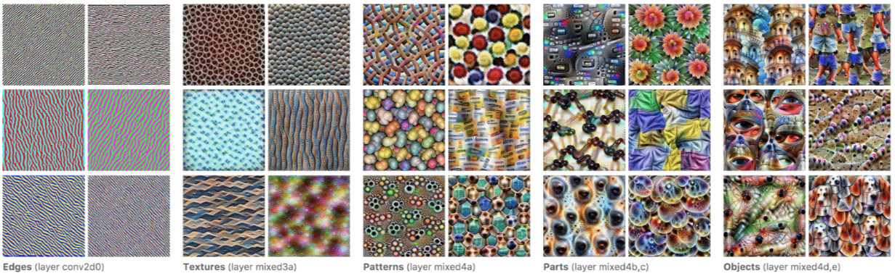

# Solutions of the Assignment 1:

**1 What are Channels and Kernels (according to EVA)?** 
Channels : 
    
Channels are the containers of specific feature. For Example If there is large data of text written in small letters and it contains all the small letters (a-z) then it will have total 26 channels. We can name the channel "a" which will have all the (a)s that may differ in size or in other attributes.

     
    

Other example can be an image then the channels will be primary colors in that image. If there is a RGB image the channel would be "R", "G" and "B".

.
Kernel : 
    
A kernel is a feature extractor that extract the features from the data. Simply a kernel is a small matrix of weights. The dot product of the matrix and the input data is taken to highlight the feature. These kernel weights are multiplied to the elements of input data and then all the multiplied outputs are added generating a single output element. This can be understood by the image given below:

  
    
For example this is an input 2D data of 5x5 size. The 3x3 matrix is kernel with element [[1, 0 -1], [1, 0 -1], [1, 0 -1]].
    The kernel is sliding through the input 2D data. At each position, it’s doing element-wise multiplication and addition. Each
    sliding position ends up with one number. After sliding through all the elements it produces a 3x3 output matrix. 
    A kernel is associated with a channel.
    A kernel, feature extractor, filter or mask are the same thing.
  

    
**2 Why should we (nearly) always use 3x3 kernels?** 
*First, Why odd sized kernel is preferred?.*

The reason behind this being that most of the filter or kernels are gaussian in nature and after convolution, the output will lie perfectly on a pixel as odd sized kernel is symmetric about the central pixel. 
This can be undertstood that why don't we use 2x2 or even size kernels.For an odd-sized filter, all the previous layer pixels 
would be symmetrically around the output pixel.

 In the image below, the kernel is applied to the group of neighbouring pixels.Kernel makes use of information provided by these pixels to output a pixel value. But a 2x2 kernel won't be able to make use of this symmetric structure of the neighbouring pixels Therefore, even sized kernels are mostly not used.
Now we know that we generally prefer odd sized kernel.

 
**Even Sized kernel** 
 
*Why do we use 3x3 kernel mostly ?*

For example: If we apply 5x5 kernel once, 25 parameters are required. Alternatively, we stack two 3x3 kernels to do the job of a 5x5 kernel and the number of parameters required will be 18 (9 + 9). It is clear that less number of parameters are required for smaller kernel. Here we can see that the parameters are reduced by a factor of 1.4 (25 / 18). So a small kernel size is preferred.  Also we dont want to miss out the local features and using a larger kernel will dissolve the local features.

And obviously, we can't use a 1x1 kernel as it does not extracts any information from neighbouring pixels. Also, most of the GPUs are accelerated for 3x3 kernels.

 
**5x5 vs 3x3 kernel**   

**3  How many times to we need to perform 3x3 convolutions operations to reach close to 1x1 from 199x199 (type each layer output like 199x199 > 197x197...)** 

***This answer is manually written. No program was used to generate it.***

199x199 > 197x197 > 195x195 > 193x193 > 191x191 > 189x189 > 187x187 > 185x185 > 183x183 > 181x181 > 179x179 > 177x177 > 
175x175 > 173x173 > 171x171 > 169x169 > 167x167 > 165x165 > 163x163 > 161x161 > 159x159 > 157x157 > 155x155 > 153x153 > 
151x151 > 149x149 > 147x147 > 145x145 > 143x143 > 141x141 > 139x139 > 137x137 > 135x135 > 133x133 > 131x131 > 129x129 > 
127x127 > 125x125 > 123x123 > 121x121 > 119x119 > 117x117 > 115x115 > 113x113 > 111x111 > 109x109 > 107x107 > 105x105 > 
103x103 > 101x101 > 99x99 > 97x97 > 95x95 > 93x93 > 91x91 > 89x89 > 87x87 > 85x85 > 83x83 > 81x81 > 79x79 > 77x77 > 
75x75 > 73x73 > 71x71 > 69x69 > 67x67 > 65x65 > 63x63 > 61x61 > 59x59 > 57x57 > 55x55 > 53x53 > 51x51 > 49x49 > 47x47 > 
45x45 > 43x43 > 41x41 > 39x39 > 37x37 > 35x35 > 33x33 > 31x31 > 29x29 > 27x27 > 25x25 > 23x23 > 21x21 > 19x19 > 17x17 > 
15x15 > 13x13 > 11x11 > 9x9 > 7x7 > 5x5 > 3x3 > 1x1

Number of times we need to perform 3x3 convolutions to get 1x1 = 99
 
  

**4. How are kernels initialized?** 

Kernel is simply a matrix. Depending on what feature we need to extract, the weights are initialised accordingly. 
The weights can be initialised ramdomly but there are consequences if the weights are too small or too high. Generally, the weights follow gaussian distribution (ie. symmetrical about the center).

   

**5. What happens during the training of a DNN?** 

After initilisation of weights in the layers of DNN, the weights need to be adjusted to get the best fit on the training data.
During the training of a DNN, the weights are tuned in such a way that the loss(difference between the actual output and the predicted output) is minimised. 
The loss is backpropagated (or simply the loss is passed back) to the previous layers so that the weights can be adjusted and overall loss can be reduced.
This way the weights are adjusted during training and system is said to have converged when the loss is minimized.

This is what happens mathematically.

Take an example of object detection, during training kernels are applied to extract the features. these features can be edges or gradients. These are then combined to make textures which are then combined to get patterns. Furthere these are combined to identify part of an object and finally the entire object.

   

**And this is how we feel when we think about DNN**  
   

## Group Members
* Happy Singh 
    (Email: hsingh0805@gmail.com)
* Vishwajeet Singh 
    (Email: vishwajeet.pratapsingh2207@gmail.com)

