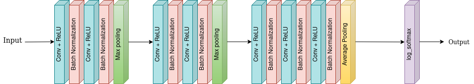

# Session 4 - Architectural Basics 

This assignment aims to design a CNN model for MNIST Classification having 99.4% with following constraints.
- Total number of parameters should be less than 20000.
- The above accuracy should be achieved within 20 epochs.
  
## Architecture



## Project Setup

### Setup on Local System
```bash
pip3 install -r packages.txt
```
### Run on Google Colab
[](https://colab.research.google.com/drive/1QVaQmHQclEhM6zsF65LYrWheXjAEeiej)


## Group Members
- Vishwajeet Pratap Singh (vishwajeet.pratapsingh2207@gmail.com)
- Happy Singh (hsingh0805@gmail.com)