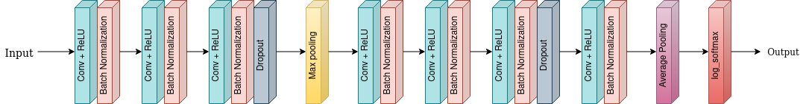

# Session 5 - Coding Drill Down

This assignment aims to design a CNN model for MNIST Classification having 99.4% with following constraints.
- Total number of parameters should be less than 10000.
- The above accuracy should be achieved within 15 epochs.


This can be achieved in four steps:

### Step 1
[](https://colab.research.google.com/drive/1FoO8WEDKpWSWGj_Hg21vGZnqKEcsc_Gp)

**Target :**
*   Setup working code
*   Train and test functions
*   dataset loaders

**Result :**
*   Total params: 15,408 
*   Best train accuracy : 99.23 
*   Best test accuracy : 98.95

**Analysis :**
*   Basic code works fine. 
*   Number of parameters are less than target parameters.
*   Train and test accuracy to be improved.
*   Also model is overfitting.


### Step 2
[](https://colab.research.google.com/drive/1JfgYRe_FX9XwDisQS3_emI_sEUrEGC-D#scrollTo=y-xqcH79a_ge)

**Target :**
*   Bring model parameters under 10k
*   Add Global Average Pool for better accuracy  

**Result :**
*   Total params: 8962
*   Best train accuracy : 98.68
*   Best test accuracy : 98.73

**Analysis :**
*   Good Model 
*   Train and test accuracies close to each other
*   Required number of parameters achieved
*   Model can be pushed further.

### Step 3
[](https://colab.research.google.com/drive/1lLzFgvXF3vQu2iRUAnL_Wi_uVGvPic1j#scrollTo=y-xqcH79a_ge)

**Target :**
*   To increase model accuracy by using batch normalisation

**Result :**
*   Total params: 9,146
*   Best train accuracy : 99.51
*   Best test accuracy : 99.40

**Analysis :**
*   Great Model 
*   Model reached the required accuracy 
*   Model fluctuates towards the end (at 15th epoch)

### Step 4
[](https://colab.research.google.com/drive/17Z-ezg3dsEjM-ZlBIVR-wh2K9pELZWER#scrollTo=ABVG78nBol_o)

**Target :**
*   To increase model accuracy by using batch normalisation

**Result :**
*   Total params: 9,146
*   Best train accuracy : 99.51
*   Best test accuracy : 99.40

**Analysis :**
*   Great Model 
*   Model reached the required accuracy 
*   Model fluctuates towards the end (at 15th epoch)
  
## Architecture



## Project Setup

### Setup on Local System
```bash
pip3 install -r packages.txt
```

## Group Members
- Vishwajeet Pratap Singh (vishwajeet.pratapsingh2207@gmail.com)
- Happy Singh (hsingh0805@gmail.com)