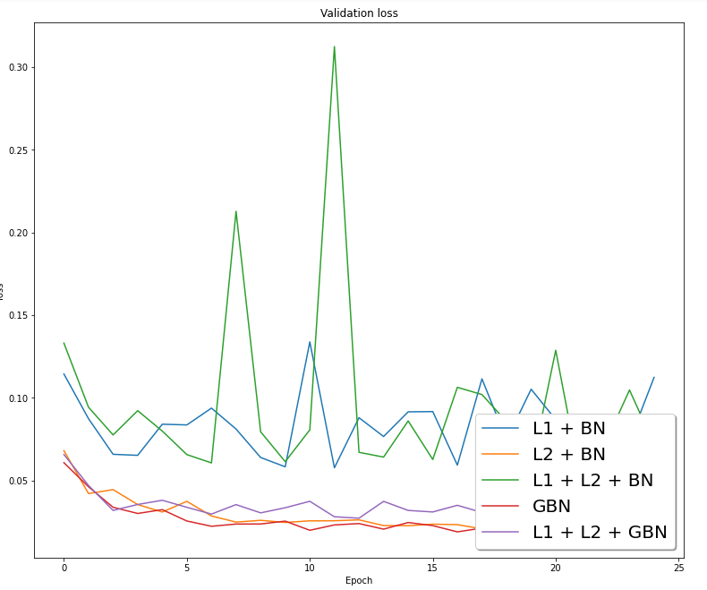

# Session 6 - Regularization
[](https://colab.research.google.com/drive/1Pjomp2kf8IKm_4reOa5KUWCvc5GgCPuV)

This assignment aims to run the model for below versions for 25 epochs and then show the validation accuracy curves and loss change curves for all these versions :

- with L1 + BN
- with L2 + BN
- with L1 and L2 with BN
- with GBN
- with L1 and L2 with GBN

After that display 25 misclassified images for "with GBN" model


## Model Architecture


## Results

### Change in validation loss



### Change in validation accuracy


## Misclassified Images


### With GBN (Ghost batch Normalization)

### Setup on Local System
```bash
pip3 install -r packages.txt
```

## Group Members
- Vishwajeet Pratap Singh (vishwajeet.pratapsingh2207@gmail.com)
- Happy Singh (hsingh0805@gmail.com)