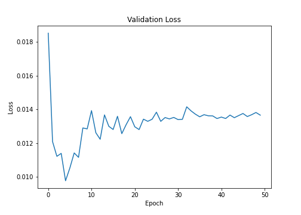
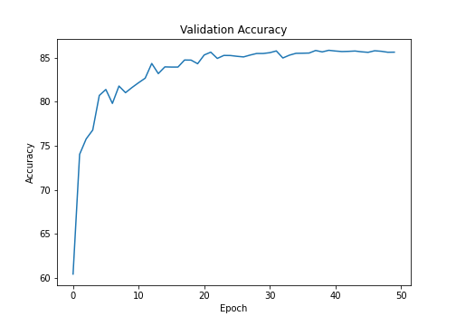

# Session 8 - Receptive Fields and Network Architectures
[](https://colab.research.google.com/drive/1HACPrd-nXT8AKnG2_CRkvvF7UnKwGktV)

This assignment aims to achieve 85% percent of accuracy on CIFAR10 using RESNET18.

## Model Used
RESNET18

## Results

Accuracy = 85.61%<br>
Epochs used = 50<br>
Parameters = 11,173,962<br><br>

### Change in validation loss


### Change in validation accuracy



### Setup on Local System
```bash
pip3 install -r packages.txt
```

## Group Members
- Vishwajeet Pratap Singh (vishwajeet.pratapsingh2207@gmail.com)
- Happy Singh (hsingh0805@gmail.com)
