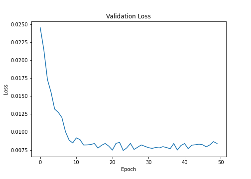
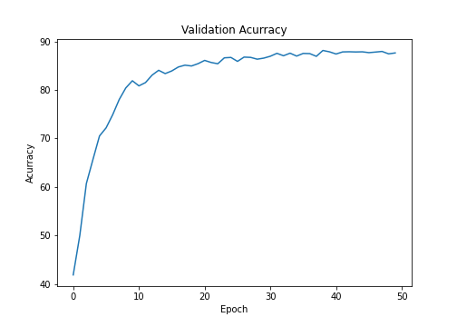
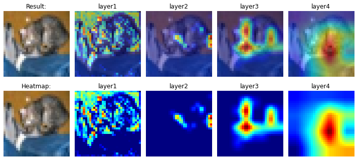
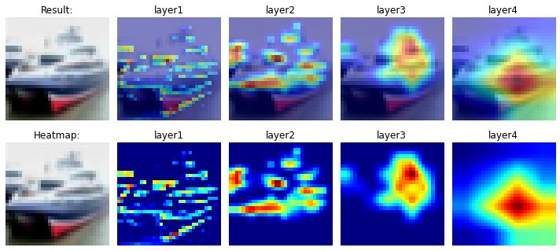
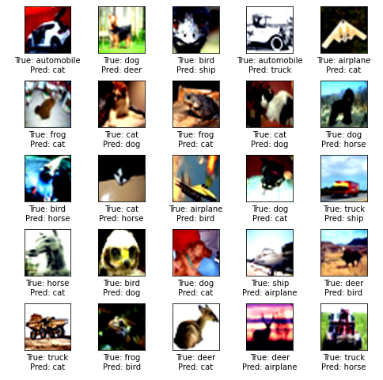

# Session 9 - Data Augmentation

This assignment targets an accuracy of 87 percent on CIFAR10 dataset by implementing the following.

- Implement the transformations in Albumentations.
- Implement GradCAM as a module.

## Model Used
Resnet18

## Results

Final Accuracy = 87.63% 
Highest Accuracy = 88.14% 
Epochs used = 50 

### Change in validation loss

### Change in validation accuracy

### Gradcam View

### Incorrect Predictions

## Group Members
- Vishwajeet Pratap Singh (vishwajeet.pratapsingh2207@gmail.com)
- Happy Singh (hsingh0805@gmail.com)
