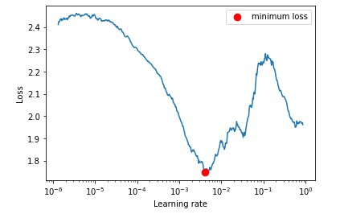
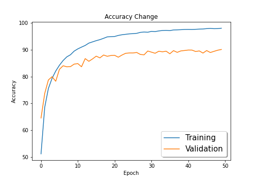
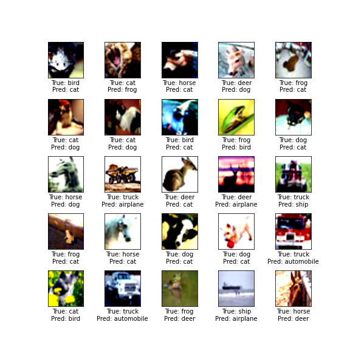
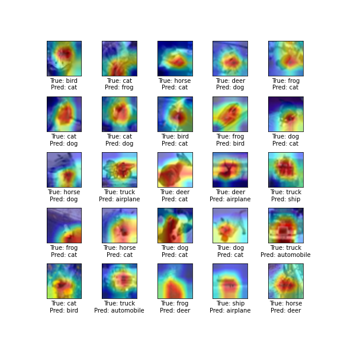

# Session 9 - Data Augmentation

This assignment targets an accuracy of 88 percent on CIFAR10 dataset by implementing the following.

- Implement LRFinder to find best initial LR.
- Implement Reduce LR on Plateau.
- Cut out in Albumentations should be present.
- Implement

## Model Used
Resnet18

## Results

Final Accuracy = 90.14% 
Highest Accuracy = 90.14% 
Epochs used = 50 
Best Initial LR = 0.0074

### LR Finder Curve

### Train and Test curves

### Incorrect Predictions

### Gradcam on Incorrect Predictions

## Group Members
- Vishwajeet Pratap Singh (vishwajeet.pratapsingh2207@gmail.com)
- Happy Singh (hsingh0805@gmail.com)
