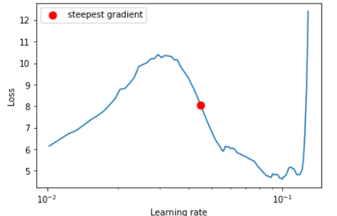
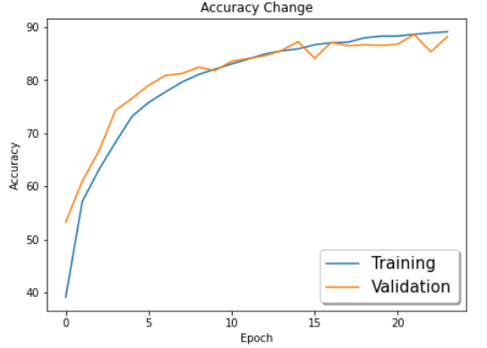
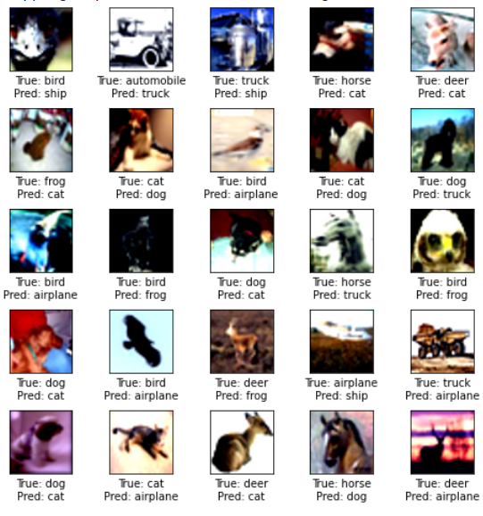

# Session 10 - Super Convergence

This assignment targets an accuracy of 90 percent on CIFAR10 dataset which uses One Cycle Policy such that: 
Total Epochs = 24 
Max at Epoch = 5 
Target accuracy = 90%  
NO Annihilation

## Model Used
Resnet18

## Results

Final Accuracy = 88.20% 
Highest Accuracy = 88.20% 
Epochs used = 24 
Batch Size = 512 

### LR Finder Curve

### Train and Test curves

### Incorrect Predictions

## Group Members
- Vishwajeet Pratap Singh (vishwajeet.pratapsingh2207@gmail.com)
- Happy Singh (hsingh0805@gmail.com)
