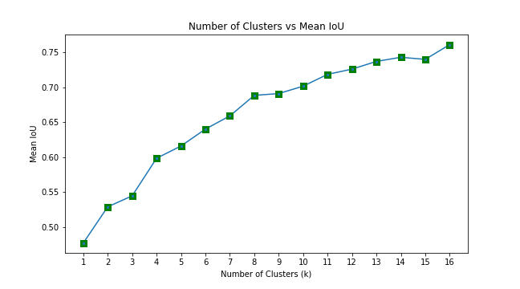
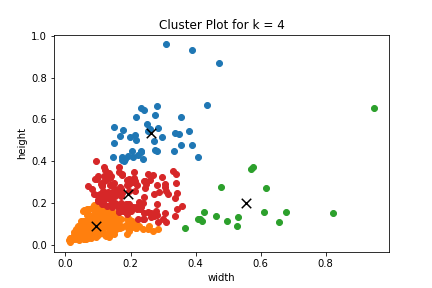
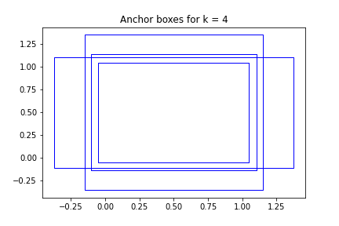
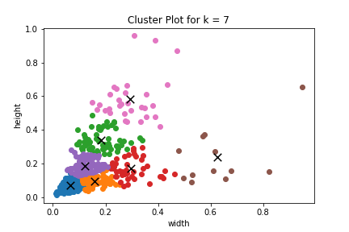
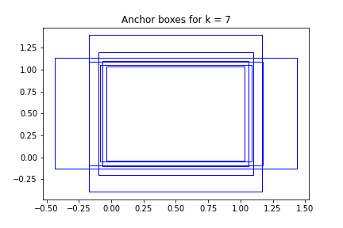

# Session 12 - Object Localisation

## Assignent-A

This assignment targets an accuracy of more than 50 percent on TinyImageNet Dataset

## Model Used
Resnet18

## Results

Final Accuracy = 53.00% 
Highest Accuracy = 53.37% 
Epochs used = 50 
Best Initial LR = 0.0014

### LR Finder Curve

### Train and Test curves

## Assignent-B

The goal is to download 50 images each of people wearing hardhat, vest, mask and boots and to annotate them. These images are exported in COCO JSON format after annotation. After that anchor boxes are found using K-Means Clustering.

### Number of clusters vs Mean IoU

After running the algorithm on the dataset, The best k value was found at 4 and 7.

| Number of Clusters (k) | Mean IoU |                  Cluster Plot                  |                 Anchor Boxes                 |
| :--------------------: | :------: | :--------------------------------------------: | :------------------------------------------: |
|           4           |   0.54   |  |  |
|           7            |   0.54   |  |  |

## Group Members
- Vishwajeet Pratap Singh (vishwajeet.pratapsingh2207@gmail.com)
- Happy Singh (hsingh0805@gmail.com)
