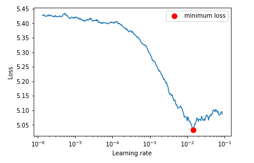
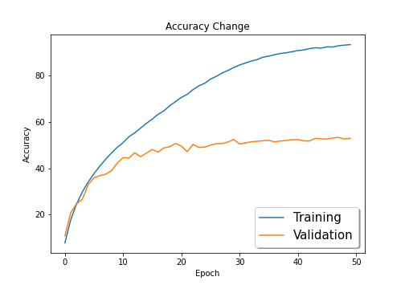

# Session 12 - Object Localisation

This assignment targets an accuracy of more than 50 percent on TinyImageNet Dataset

## Model Used
Resnet18

## Results

Final Accuracy = 53.00% 
Highest Accuracy = 53.37% 
Epochs used = 50 
Best Initial LR = 0.0014

### LR Finder Curve

### Train and Test curves

## Group Members
- Vishwajeet Pratap Singh (vishwajeet.pratapsingh2207@gmail.com)
- Happy Singh (hsingh0805@gmail.com)
